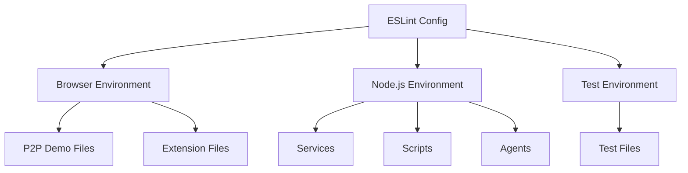
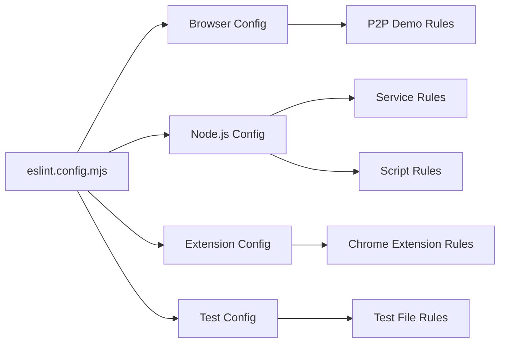

# ESLint Error Resolution Design

## Overview

The project is experiencing 153 ESLint errors (107 errors, 46 warnings) that are preventing successful commits due to lint-staged configuration. The errors primarily stem from incorrect environment configuration in ESLint and missing browser/Node.js globals for different file contexts.

## Repository Analysis

The codebase follows a **monorepo architecture** with:

- **Frontend components**: Browser-based P2P demo application
- **Backend services**: Node.js services (offers, signaling)
- **Development scripts**: Node.js build and utility scripts
- **Test files**: Node.js test modules
- **Browser extension**: Chrome MV3 extension

## Current ESLint Configuration Issues

### Environment Configuration Problems

The current `eslint.config.mjs` has a single configuration that treats all files uniformly:

```javascript
globals: {
  console: "readonly",
  process: "readonly",
  URL: "readonly"
}
```

This causes **context mismatches**:

- Browser files lack DOM globals (`document`, `window`, `navigator`)
- Node.js files missing built-in globals (`setTimeout`, `setInterval`, `global`)
- Test files missing Node.js test globals

### File Context Classification

| File Type                | Environment | Required Globals                                                                                           |
| ------------------------ | ----------- | ---------------------------------------------------------------------------------------------------------- |
| `apps/p2p-demo/**/*.js`  | Browser     | `document`, `window`, `navigator`, `localStorage`, `alert`, `setTimeout`, `WebSocket`, `RTCPeerConnection` |
| `apps/extension/**/*.js` | Browser     | Chrome extension APIs, DOM globals                                                                         |
| `services/**/*.mjs`      | Node.js     | `setTimeout`, `setInterval`, `global`, `process`                                                           |
| `scripts/**/*.mjs`       | Node.js     | Node.js built-ins, `process`, `console`                                                                    |
| `tests/**/*.mjs`         | Node.js     | Test globals, Node.js timers                                                                               |
| `agents/**/*.mjs`        | Node.js     | Node.js environment                                                                                        |

## ESLint Configuration Design

### Multi-Environment Configuration Strategy



### Environment-Specific Rules

```javascript
export default [
  // Browser environment (P2P demo)
  {
    files: ['apps/p2p-demo/**/*.js'],
    languageOptions: {
      ecmaVersion: 'latest',
      sourceType: 'module',
      globals: {
        // DOM and Browser APIs
        document: 'readonly',
        window: 'readonly',
        navigator: 'readonly',
        localStorage: 'readonly',
        alert: 'readonly',
        // Timing functions
        setTimeout: 'readonly',
        clearTimeout: 'readonly',
        setInterval: 'readonly',
        clearInterval: 'readonly',
        // WebRTC and WebSocket
        WebSocket: 'readonly',
        RTCPeerConnection: 'readonly',
        performance: 'readonly',
      },
    },
  },
  // Node.js environment
  {
    files: ['**/*.mjs', 'scripts/**/*.js'],
    excludes: ['apps/**/*.js'],
    languageOptions: {
      globals: {
        global: 'readonly',
        process: 'readonly',
        console: 'readonly',
        setTimeout: 'readonly',
        clearTimeout: 'readonly',
        setInterval: 'readonly',
        clearInterval: 'readonly',
      },
    },
  },
];
```

## Code Quality Issues Resolution

### Unused Variables Strategy

**Problem**: Many warnings for unused function parameters that are required by interfaces.

**Solution**: Use underscore prefix convention consistently:

```javascript
// Before (causes warning)
function handler(error, data) {
  return data;
}

// After (follows ESLint rule)
function handler(_error, data) {
  return data;
}
```

### Missing File Handling

**Problem**: ESLint is trying to lint files that don't exist in the repository.

**Investigation needed**:

- Check if files were moved/renamed
- Verify lint-staged is targeting correct file patterns
- Update `.gitignore` or ESLint ignores if needed

## Implementation Architecture

### Configuration Structure



### Rule Inheritance Strategy

1. **Base configuration**: Common rules for all files
2. **Environment-specific overrides**: Browser vs Node.js globals
3. **File-type specific rules**: Additional rules for tests, extensions
4. **Progressive enhancement**: Start with permissive rules, tighten gradually

## Lint-Staged Integration

### Current Configuration

```json
"lint-staged": {
  "*.{js,mjs}": ["eslint --fix"],
  "*.{json,md,css}": ["prettier -w"]
}
```

### Verification Strategy

- Test configuration with individual file linting before commit
- Use `--debug` flag to verify rule application
- Implement pre-commit testing workflow

## Testing Strategy

### Configuration Validation

1. **Unit tests for each environment**:

   ```bash
   npx eslint apps/p2p-demo/**/*.js --debug
   npx eslint services/**/*.mjs --debug
   npx eslint tests/**/*.mjs --debug
   ```

2. **Integration testing**:
   - Test lint-staged workflow locally
   - Verify git hooks function correctly
   - Ensure CI pipeline compatibility

### Rollback Strategy

- Keep current configuration as backup
- Implement changes incrementally
- Test each environment configuration separately

## Error Resolution Priority

### High Priority (Blocking Commits)

1. **Environment globals**: Fix `no-undef` errors
2. **Missing files**: Investigate and resolve file system mismatches
3. **Critical syntax errors**: Any errors that break functionality

### Medium Priority (Code Quality)

1. **Unused variables**: Apply underscore prefix pattern
2. **Dead code**: Remove truly unused code
3. **Parameter naming**: Standardize unused parameter conventions

### Low Priority (Warnings)

1. **Style consistency**: Align with project standards
2. **Documentation**: Add JSDoc for public APIs
3. **Performance optimizations**: Address any performance anti-patterns

## Deployment Considerations

### Backward Compatibility

- Ensure existing development workflow continues
- Maintain CI/CD pipeline compatibility
- Preserve git hook functionality

### Developer Experience

- Provide clear error messages
- Document new configuration structure
- Include troubleshooting guide for common issues

### Monitoring and Maintenance

- Track ESLint rule effectiveness
- Monitor for new environment requirements
- Regular configuration review and updates
