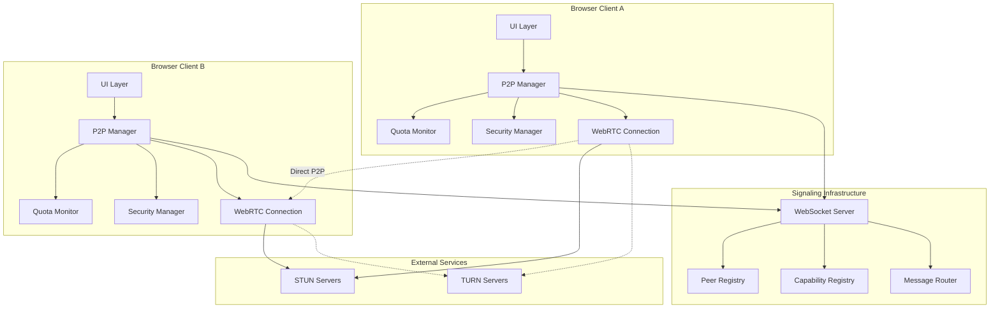
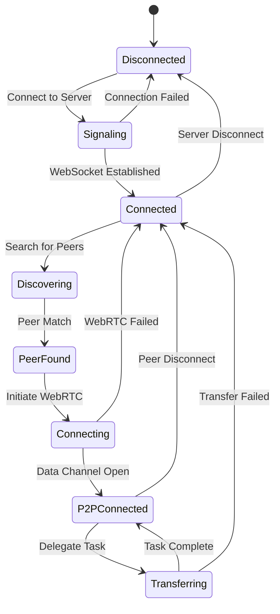

# P2P Task Handoff Demo Design

## Overview

The P2P Task Handoff Demo is a real-time peer-to-peer application that demonstrates intelligent AI prompt delegation between browser clients using WebRTC data channels. The system enables direct browser-to-browser communication for distributing AI workloads based on quota availability, capabilities, and network conditions.

**Current State**: The repository contains only placeholder implementations. The P2P demo at localhost:8082 shows a basic HTML page with placeholder content, while the documented architecture describes a more comprehensive system with signaling servers, WebRTC connections, and quota management.

**Core Value Proposition**:

- Decentralized AI workload distribution without centralized compute infrastructure
- Real-time peer discovery and capability matching
- Efficient quota-aware task delegation
- Direct P2P communication minimizing server load and latency

## Technology Stack & Dependencies

### Frontend Technologies

- **Runtime**: Modern browsers with WebRTC support
- **Core APIs**: WebRTC, WebSocket, DOM APIs
- **Implementation**: Vanilla JavaScript (ES6+), HTML5, CSS3
- **No External Dependencies**: Self-contained implementation following project simplicity guidelines

### Backend Infrastructure

- **Signaling Server**: Node.js with WebSocket (ws library)
- **Development Server**: Custom HTTP server (scripts/dev.mjs)
- **Port Configuration**:
  - P2P Demo: 8082
  - Signaling Server: 8083
  - Offers Service: 8081

### P2P Communication Stack

- **WebRTC**: Data channels for direct peer communication
- **WebSocket**: Signaling coordination and peer discovery
- **STUN/TURN**: NAT traversal and connection establishment
- **Future Integration**: libp2p transport layer for enhanced P2P capabilities

## Architecture

### System Architecture Overview



### Component Architecture

#### P2P Manager (Enhanced P2P Manager)

**Responsibilities**:

- WebRTC connection lifecycle management
- Peer discovery and capability negotiation
- Data channel creation and message routing
- Connection state management and recovery
- Integration with quota and security systems

**Key Interfaces**:

```javascript
class EnhancedP2PManager {
  async connect(signalingUrl)
  async discoverPeers(requirements)
  async delegatePrompt(prompt, targetPeerId)
  async handleIncomingPrompt(prompt, senderId)
  onConnectionStateChange(callback)
  onPeerDiscovered(callback)
}
```

#### Quota Monitor

**Responsibilities**:

- Track local AI quota usage and availability
- Monitor peer quota status
- Provide quota-aware routing decisions
- Rate limiting and usage enforcement

**Quota Data Model**:

```javascript
{
  totalQuota: number,
  usedQuota: number,
  availableQuota: number,
  resetTime: timestamp,
  provider: string,
  capabilities: string[]
}
```

#### Security Manager

**Responsibilities**:

- Content filtering for malicious prompts
- Rate limiting and abuse prevention
- Peer authentication and trust scoring
- Data sanitization and validation

#### WebRTC Connection Layer

**Responsibilities**:

- SDP offer/answer exchange
- ICE candidate negotiation
- Data channel establishment
- Network quality monitoring
- Connection recovery and fallback

### Message Schemas & Protocol Design

#### Signaling Protocol Messages

**Connection Management**:

```javascript
// Peer Registration
{
  type: 'peer-id',
  peerId: 'unique-peer-identifier'
}

// Capability Announcement
{
  type: 'capability-announce',
  capabilities: {
    hasAI: boolean,
    models: string[],
    quota: QuotaStatus,
    performance: PerformanceMetrics
  }
}

// Peer Discovery
{
  type: 'discover',
  requirements: {
    needsAI: boolean,
    minQuota: number,
    preferredModels: string[]
  }
}
```

**WebRTC Signaling**:

```javascript
// SDP Exchange
{
  type: 'offer' | 'answer',
  targetPeerId: string,
  sdp: RTCSessionDescription
}

// ICE Candidates
{
  type: 'ice-candidate',
  targetPeerId: string,
  candidate: RTCIceCandidate
}
```

**Task Delegation**:

```javascript
// Prompt Delegation Request
{
  type: 'prompt-delegation',
  taskId: string,
  prompt: string,
  requesterCapabilities: object,
  priority: number,
  timeout: number
}

// Streaming Response
{
  type: 'prompt-response',
  taskId: string,
  chunk: string,
  isComplete: boolean,
  metadata: object
}
```

### Connection Establishment Flow

```mermaid
sequenceDiagram
    participant CA as Client A
    participant SS as Signaling Server
    participant CB as Client B

    CA->>SS: Connect WebSocket
    CB->>SS: Connect WebSocket
    SS-->>CA: peer-id assignment
    SS-->>CB: peer-id assignment

    CA->>SS: capability-announce
    CB->>SS: capability-announce
    SS->>CB: peer-capability-update (A's info)
    SS->>CA: peer-capability-update (B's info)

    CA->>SS: discover {needsAI: true}
    SS-->>CA: peers-discovered [CB]

    CA->>SS: WebRTC offer to CB
    SS->>CB: Forward offer
    CB->>SS: WebRTC answer to CA
    SS->>CA: Forward answer

    loop ICE Candidate Exchange
        CA->>SS: ICE candidate
        SS->>CB: Forward candidate
        CB->>SS: ICE candidate
        SS->>CA: Forward candidate
    end

    CA<-->CB: Direct P2P Data Channel
    CA->>CB: prompt-delegation
    CB-->>CA: streaming response chunks
```

## Routing & Navigation

### Application State Management

The P2P demo follows a single-page application pattern with distinct connection states:



### UI State Synchronization

**Connection Status Display**:

- Real-time connection state indicators
- Peer count and capability summaries
- Network quality metrics
- Quota usage visualization

**Navigation Flow**:

1. Initial connection to signaling server
2. Capability announcement and peer discovery
3. Peer selection interface
4. Task delegation interface with real-time feedback
5. Results display and history

## Styling Strategy

### Design System Approach

- **Minimal CSS**: Vanilla CSS3 with CSS Grid and Flexbox
- **Responsive Design**: Mobile-first approach with viewport-based units
- **Real-time Indicators**: CSS animations for connection states
- **Accessibility**: WCAG 2.1 compliance with proper ARIA labels

### Visual Hierarchy

```css
/* Connection Status Bar */
.status-bar {
  position: fixed;
  top: 0;
  background: var(--status-color);
  transition: background-color 0.3s ease;
}

/* Peer Grid Layout */
.peer-grid {
  display: grid;
  grid-template-columns: repeat(auto-fill, minmax(300px, 1fr));
  gap: 1rem;
}

/* Real-time Animations */
.connecting {
  animation: pulse 1s infinite;
}

.transferring {
  animation: progress-bar 2s linear infinite;
}
```

## API Integration Layer

### Signaling Service Integration

**WebSocket Connection Management**:

```javascript
class SignalingClient {
  constructor(url) {
    this.ws = new WebSocket(url);
    this.messageHandlers = new Map();
    this.setupEventHandlers();
  }

  send(message) {
    if (this.ws.readyState === WebSocket.OPEN) {
      this.ws.send(JSON.stringify(message));
    }
  }

  onMessage(type, handler) {
    this.messageHandlers.set(type, handler);
  }
}
```

**WebRTC Integration**:

```javascript
class WebRTCManager {
  constructor() {
    this.connections = new Map();
    this.dataChannels = new Map();
    this.config = {
      iceServers: [
        { urls: 'stun:stun.l.google.com:19302' },
        { urls: 'stun:stun1.l.google.com:19302' },
      ],
    };
  }

  async createConnection(peerId) {
    const pc = new RTCPeerConnection(this.config);
    this.setupConnectionHandlers(pc, peerId);
    this.connections.set(peerId, pc);
    return pc;
  }
}
```

### External Service Integration

**STUN/TURN Server Configuration**:

- Google STUN servers for development
- Configurable TURN servers for production NAT traversal
- Fallback mechanisms for restricted networks

**Future AI Service Integration**:

- Chrome AI API integration for local inference
- External AI provider API delegation
- Quota monitoring across multiple providers

## Testing Strategy

### Unit Testing Framework

**Test Structure** (using simple assertion-based approach):

```javascript
// test/p2p-manager.test.js
import assert from 'assert';
import { EnhancedP2PManager } from '../js/enhanced-p2p-manager.js';

describe('EnhancedP2PManager', () => {
  let manager;

  beforeEach(() => {
    manager = new EnhancedP2PManager();
  });

  it('should initialize with disconnected state', () => {
    assert.strictEqual(manager.connectionState, 'disconnected');
  });

  it('should validate message schemas', () => {
    const validMessage = {
      type: 'prompt-delegation',
      taskId: 'test-123',
      prompt: 'test prompt',
    };
    assert.doesNotThrow(() => manager.validateMessage(validMessage));
  });
});
```

### Integration Testing Strategy

**Real-time P2P Integration Tests**:

```javascript
// test/integration/p2p-flow.test.js
describe('P2P Communication Flow', () => {
  let signalingServer, clientA, clientB;

  before(async () => {
    signalingServer = await startTestSignalingServer();
    clientA = new P2PClient('ws://localhost:8084');
    clientB = new P2PClient('ws://localhost:8084');
  });

  it('should establish peer connection and delegate task', async () => {
    await Promise.all([clientA.connect(), clientB.connect()]);
    await clientA.discoverPeers();
    const result = await clientA.delegatePrompt('test prompt');
    assert.ok(result.success);
  });
});
```

### Browser Compatibility Testing

- WebRTC feature detection and fallbacks
- Cross-browser WebSocket compatibility
- Mobile browser testing (Chrome, Safari, Firefox)
- Progressive enhancement for older browsers

### Performance Testing

- Connection establishment time measurement
- Data channel throughput testing
- Memory usage monitoring during long sessions
- Network quality impact assessment

## Error Handling & Recovery

### Connection Recovery Strategies

**WebSocket Reconnection**:

```javascript
class ResilientWebSocket {
  constructor(url, options = {}) {
    this.url = url;
    this.reconnectAttempts = 0;
    this.maxReconnectAttempts = options.maxRetries || 5;
    this.reconnectDelay = options.delay || 1000;
    this.connect();
  }

  connect() {
    try {
      this.ws = new WebSocket(this.url);
      this.setupHandlers();
    } catch (error) {
      this.scheduleReconnect();
    }
  }

  scheduleReconnect() {
    if (this.reconnectAttempts < this.maxReconnectAttempts) {
      setTimeout(() => this.connect(), this.reconnectDelay);
      this.reconnectAttempts++;
    }
  }
}
```

**WebRTC Connection Fallbacks**:

- ICE connection failure detection
- TURN server fallback for restricted networks
- Graceful degradation to server-relayed communication
- Automatic peer re-discovery on connection loss

### Error Categories & Handling

**Network Errors**:

- WebSocket connection failures
- WebRTC negotiation failures
- STUN/TURN server unavailability
- Data channel closure

**Application Errors**:

- Invalid message schema
- Quota exhaustion
- Peer unavailability
- Task execution timeouts

**Security Errors**:

- Malicious content detection
- Rate limiting violations
- Authentication failures
- Data validation errors

## Security Considerations

### Content Security & Filtering

**Prompt Sanitization**:

```javascript
class SecurityManager {
  validatePrompt(prompt) {
    // Check for malicious patterns
    const dangerousPatterns = [/system\s+prompt/i, /ignore\s+previous/i, /execute\s+code/i];

    return !dangerousPatterns.some((pattern) => pattern.test(prompt));
  }

  sanitizeResponse(response) {
    // Remove potentially harmful content
    return response.replace(/<script\b[^<]*(?:(?!<\/script>)<[^<]*)*<\/script>/gi, '');
  }
}
```

### Rate Limiting & Abuse Prevention

**Connection Rate Limiting**:

- Maximum connections per IP address
- Request rate limiting per peer
- Quota-based usage enforcement
- Temporary peer blocking for violations

**Data Validation**:

- Message schema validation
- Payload size limits
- Content type restrictions
- Cryptographic message signing (future enhancement)

### Privacy & Data Protection

**Data Minimization**:

- No persistent storage of prompts or responses
- Temporary peer capability caching
- Session-based connection management
- Configurable data retention policies

**Encryption Considerations**:

- WebRTC DTLS encryption for data channels
- WebSocket Secure (WSS) for signaling
- End-to-end encryption for sensitive workloads (future)

## Performance Optimization

### Connection Pooling & Management

**Peer Connection Optimization**:

```javascript
class ConnectionPool {
  constructor(maxConnections = 10) {
    this.pool = new Map();
    this.maxConnections = maxConnections;
    this.connectionQueue = [];
  }

  async getConnection(peerId) {
    if (this.pool.has(peerId)) {
      return this.pool.get(peerId);
    }

    if (this.pool.size >= this.maxConnections) {
      await this.recycleOldestConnection();
    }

    return this.createNewConnection(peerId);
  }
}
```

### Peer Selection Optimization

**Performance-based Peer Ranking**:

```javascript
class PeerSelector {
  rankPeers(peers, requirements) {
    return peers
      .map((peer) => ({
        ...peer,
        score: this.calculateScore(peer, requirements),
      }))
      .sort((a, b) => b.score - a.score);
  }

  calculateScore(peer, requirements) {
    let score = 0;
    score += peer.quota.available * 0.4;
    score += peer.performance.latency < 100 ? 30 : 0;
    score += peer.capabilities.models.length * 0.1;
    return score;
  }
}
```

### Network Quality Monitoring

**Real-time Metrics Collection**:

- RTT (Round Trip Time) measurement
- Data channel throughput monitoring
- Connection stability tracking
- Adaptive quality adjustment based on network conditions

### Resource Usage Optimization

**Memory Management**:

- Connection pooling to limit resource usage
- Automatic cleanup of stale connections
- Efficient message queuing and buffering
- Garbage collection optimization for long-running sessions

**CPU Optimization**:

- Asynchronous message processing
- Web Worker integration for heavy computations
- Efficient JSON serialization/deserialization
- Throttled UI updates to prevent frame drops- Decentralized AI workload distribution without centralized compute infrastructure
- Real-time peer discovery and capability matching
- Efficient quota-aware task delegation
- Direct P2P communication minimizing server load and latency

## Technology Stack & Dependencies

### Frontend Technologies

- **Runtime**: Modern browsers with WebRTC support
- **Core APIs**: WebRTC, WebSocket, DOM APIs
- **Implementation**: Vanilla JavaScript (ES6+), HTML5, CSS3
- **No External Dependencies**: Self-contained implementation following project simplicity guidelines

### Backend Infrastructure

- **Signaling Server**: Node.js with WebSocket (ws library)
- **Development Server**: Custom HTTP server (scripts/dev.mjs)
- **Port Configuration**:
  - P2P Demo: 8082
  - Signaling Server: 8083
  - Offers Service: 8081

### P2P Communication Stack

- **WebRTC**: Data channels for direct peer communication
- **WebSocket**: Signaling coordination and peer discovery
- **STUN/TURN**: NAT traversal and connection establishment
- **Future Integration**: libp2p transport layer for enhanced P2P capabilities

## Architecture

### System Architecture Overview


### Component Architecture

#### P2P Manager (Enhanced P2P Manager)

**Responsibilities**:

- WebRTC connection lifecycle management
- Peer discovery and capability negotiation
- Data channel creation and message routing
- Connection state management and recovery
- Integration with quota and security systems

**Key Interfaces**:

```javascript
class EnhancedP2PManager {
  async connect(signalingUrl)
  async discoverPeers(requirements)
  async delegatePrompt(prompt, targetPeerId)
  async handleIncomingPrompt(prompt, senderId)
  onConnectionStateChange(callback)
  onPeerDiscovered(callback)
}
```

#### Quota Monitor

**Responsibilities**:

- Track local AI quota usage and availability
- Monitor peer quota status
- Provide quota-aware routing decisions
- Rate limiting and usage enforcement

**Quota Data Model**:

```javascript
{
  totalQuota: number,
  usedQuota: number,
  availableQuota: number,
  resetTime: timestamp,
  provider: string,
  capabilities: string[]
}
```

#### Security Manager

**Responsibilities**:

- Content filtering for malicious prompts
- Rate limiting and abuse prevention
- Peer authentication and trust scoring
- Data sanitization and validation

#### WebRTC Connection Layer

**Responsibilities**:

- SDP offer/answer exchange
- ICE candidate negotiation
- Data channel establishment
- Network quality monitoring
- Connection recovery and fallback

### Message Schemas & Protocol Design

#### Signaling Protocol Messages

**Connection Management**:

```javascript
// Peer Registration
{
  type: 'peer-id',
  peerId: 'unique-peer-identifier'
}

// Capability Announcement
{
  type: 'capability-announce',
  capabilities: {
    hasAI: boolean,
    models: string[],
    quota: QuotaStatus,
    performance: PerformanceMetrics
  }
}

// Peer Discovery
{
  type: 'discover',
  requirements: {
    needsAI: boolean,
    minQuota: number,
    preferredModels: string[]
  }
}
```

**WebRTC Signaling**:

```javascript
// SDP Exchange
{
  type: 'offer' | 'answer',
  targetPeerId: string,
  sdp: RTCSessionDescription
}

// ICE Candidates
{
  type: 'ice-candidate',
  targetPeerId: string,
  candidate: RTCIceCandidate
}
```

**Task Delegation**:

```javascript
// Prompt Delegation Request
{
  type: 'prompt-delegation',
  taskId: string,
  prompt: string,
  requesterCapabilities: object,
  priority: number,
  timeout: number
}

// Streaming Response
{
  type: 'prompt-response',
  taskId: string,
  chunk: string,
  isComplete: boolean,
  metadata: object
}
```

### Connection Establishment Flow

```mermaid
sequenceDiagram
    participant CA as Client A
    participant SS as Signaling Server
    participant CB as Client B

    CA->>SS: Connect WebSocket
    CB->>SS: Connect WebSocket
    SS-->>CA: peer-id assignment
    SS-->>CB: peer-id assignment

    CA->>SS: capability-announce
    CB->>SS: capability-announce
    SS->>CB: peer-capability-update (A's info)
    SS->>CA: peer-capability-update (B's info)

    CA->>SS: discover {needsAI: true}
    SS-->>CA: peers-discovered [CB]

    CA->>SS: WebRTC offer to CB
    SS->>CB: Forward offer
    CB->>SS: WebRTC answer to CA
    SS->>CA: Forward answer

    loop ICE Candidate Exchange
        CA->>SS: ICE candidate
        SS->>CB: Forward candidate
        CB->>SS: ICE candidate
        SS->>CA: Forward candidate
    end

    CA<-->CB: Direct P2P Data Channel
    CA->>CB: prompt-delegation
    CB-->>CA: streaming response chunks
```

## Routing & Navigation

### Application State Management

The P2P demo follows a single-page application pattern with distinct connection states:


### UI State Synchronization

**Connection Status Display**:

- Real-time connection state indicators
- Peer count and capability summaries
- Network quality metrics
- Quota usage visualization

**Navigation Flow**:

1. Initial connection to signaling server
2. Capability announcement and peer discovery
3. Peer selection interface
4. Task delegation interface with real-time feedback
5. Results display and history

## Styling Strategy

### Design System Approach

- **Minimal CSS**: Vanilla CSS3 with CSS Grid and Flexbox
- **Responsive Design**: Mobile-first approach with viewport-based units
- **Real-time Indicators**: CSS animations for connection states
- **Accessibility**: WCAG 2.1 compliance with proper ARIA labels

### Visual Hierarchy

```css
/* Connection Status Bar */
.status-bar {
  position: fixed;
  top: 0;
  background: var(--status-color);
  transition: background-color 0.3s ease;
}

/* Peer Grid Layout */
.peer-grid {
  display: grid;
  grid-template-columns: repeat(auto-fill, minmax(300px, 1fr));
  gap: 1rem;
}

/* Real-time Animations */
.connecting {
  animation: pulse 1s infinite;
}

.transferring {
  animation: progress-bar 2s linear infinite;
}
```

## API Integration Layer

### Signaling Service Integration

**WebSocket Connection Management**:

```javascript
class SignalingClient {
  constructor(url) {
    this.ws = new WebSocket(url);
    this.messageHandlers = new Map();
    this.setupEventHandlers();
  }

  send(message) {
    if (this.ws.readyState === WebSocket.OPEN) {
      this.ws.send(JSON.stringify(message));
    }
  }

  onMessage(type, handler) {
    this.messageHandlers.set(type, handler);
  }
}
```

**WebRTC Integration**:

```javascript
class WebRTCManager {
  constructor() {
    this.connections = new Map();
    this.dataChannels = new Map();
    this.config = {
      iceServers: [
        { urls: 'stun:stun.l.google.com:19302' },
        { urls: 'stun:stun1.l.google.com:19302' },
      ],
    };
  }

  async createConnection(peerId) {
    const pc = new RTCPeerConnection(this.config);
    this.setupConnectionHandlers(pc, peerId);
    this.connections.set(peerId, pc);
    return pc;
  }
}
```

### External Service Integration

**STUN/TURN Server Configuration**:

- Google STUN servers for development
- Configurable TURN servers for production NAT traversal
- Fallback mechanisms for restricted networks

**Future AI Service Integration**:

- Chrome AI API integration for local inference
- External AI provider API delegation
- Quota monitoring across multiple providers

## Testing Strategy

### Unit Testing Framework

**Test Structure** (using simple assertion-based approach):

```javascript
// test/p2p-manager.test.js
import assert from 'assert';
import { EnhancedP2PManager } from '../js/enhanced-p2p-manager.js';

describe('EnhancedP2PManager', () => {
  let manager;

  beforeEach(() => {
    manager = new EnhancedP2PManager();
  });

  it('should initialize with disconnected state', () => {
    assert.strictEqual(manager.connectionState, 'disconnected');
  });

  it('should validate message schemas', () => {
    const validMessage = {
      type: 'prompt-delegation',
      taskId: 'test-123',
      prompt: 'test prompt',
    };
    assert.doesNotThrow(() => manager.validateMessage(validMessage));
  });
});
```

### Integration Testing Strategy

**Real-time P2P Integration Tests**:

```javascript
// test/integration/p2p-flow.test.js
describe('P2P Communication Flow', () => {
  let signalingServer, clientA, clientB;

  before(async () => {
    signalingServer = await startTestSignalingServer();
    clientA = new P2PClient('ws://localhost:8084');
    clientB = new P2PClient('ws://localhost:8084');
  });

  it('should establish peer connection and delegate task', async () => {
    await Promise.all([clientA.connect(), clientB.connect()]);
    await clientA.discoverPeers();
    const result = await clientA.delegatePrompt('test prompt');
    assert.ok(result.success);
  });
});
```

### Browser Compatibility Testing

- WebRTC feature detection and fallbacks
- Cross-browser WebSocket compatibility
- Mobile browser testing (Chrome, Safari, Firefox)
- Progressive enhancement for older browsers

### Performance Testing

- Connection establishment time measurement
- Data channel throughput testing
- Memory usage monitoring during long sessions
- Network quality impact assessment

## Error Handling & Recovery

### Connection Recovery Strategies

**WebSocket Reconnection**:

```javascript
class ResilientWebSocket {
  constructor(url, options = {}) {
    this.url = url;
    this.reconnectAttempts = 0;
    this.maxReconnectAttempts = options.maxRetries || 5;
    this.reconnectDelay = options.delay || 1000;
    this.connect();
  }

  connect() {
    try {
      this.ws = new WebSocket(this.url);
      this.setupHandlers();
    } catch (error) {
      this.scheduleReconnect();
    }
  }

  scheduleReconnect() {
    if (this.reconnectAttempts < this.maxReconnectAttempts) {
      setTimeout(() => this.connect(), this.reconnectDelay);
      this.reconnectAttempts++;
    }
  }
}
```

**WebRTC Connection Fallbacks**:

- ICE connection failure detection
- TURN server fallback for restricted networks
- Graceful degradation to server-relayed communication
- Automatic peer re-discovery on connection loss

### Error Categories & Handling

**Network Errors**:

- WebSocket connection failures
- WebRTC negotiation failures
- STUN/TURN server unavailability
- Data channel closure

**Application Errors**:

- Invalid message schema
- Quota exhaustion
- Peer unavailability
- Task execution timeouts

**Security Errors**:

- Malicious content detection
- Rate limiting violations
- Authentication failures
- Data validation errors

## Security Considerations

### Content Security & Filtering

**Prompt Sanitization**:

```javascript
class SecurityManager {
  validatePrompt(prompt) {
    // Check for malicious patterns
    const dangerousPatterns = [/system\s+prompt/i, /ignore\s+previous/i, /execute\s+code/i];

    return !dangerousPatterns.some((pattern) => pattern.test(prompt));
  }

  sanitizeResponse(response) {
    // Remove potentially harmful content
    return response.replace(/<script\b[^<]*(?:(?!<\/script>)<[^<]*)*<\/script>/gi, '');
  }
}
```

### Rate Limiting & Abuse Prevention

**Connection Rate Limiting**:

- Maximum connections per IP address
- Request rate limiting per peer
- Quota-based usage enforcement
- Temporary peer blocking for violations

**Data Validation**:

- Message schema validation
- Payload size limits
- Content type restrictions
- Cryptographic message signing (future enhancement)

### Privacy & Data Protection

**Data Minimization**:

- No persistent storage of prompts or responses
- Temporary peer capability caching
- Session-based connection management
- Configurable data retention policies

**Encryption Considerations**:

- WebRTC DTLS encryption for data channels
- WebSocket Secure (WSS) for signaling
- End-to-end encryption for sensitive workloads (future)

## Performance Optimization

### Connection Pooling & Management

**Peer Connection Optimization**:

```javascript
class ConnectionPool {
  constructor(maxConnections = 10) {
    this.pool = new Map();
    this.maxConnections = maxConnections;
    this.connectionQueue = [];
  }

  async getConnection(peerId) {
    if (this.pool.has(peerId)) {
      return this.pool.get(peerId);
    }

    if (this.pool.size >= this.maxConnections) {
      await this.recycleOldestConnection();
    }

    return this.createNewConnection(peerId);
  }
}
```

### Peer Selection Optimization

**Performance-based Peer Ranking**:

```javascript
class PeerSelector {
  rankPeers(peers, requirements) {
    return peers
      .map((peer) => ({
        ...peer,
        score: this.calculateScore(peer, requirements),
      }))
      .sort((a, b) => b.score - a.score);
  }

  calculateScore(peer, requirements) {
    let score = 0;
    score += peer.quota.available * 0.4;
    score += peer.performance.latency < 100 ? 30 : 0;
    score += peer.capabilities.models.length * 0.1;
    return score;
  }
}
```

### Network Quality Monitoring

**Real-time Metrics Collection**:

- RTT (Round Trip Time) measurement
- Data channel throughput monitoring
- Connection stability tracking
- Adaptive quality adjustment based on network conditions

### Resource Usage Optimization

**Memory Management**:

- Connection pooling to limit resource usage
- Automatic cleanup of stale connections
- Efficient message queuing and buffering
- Garbage collection optimization for long-running sessions

**CPU Optimization**:

- Asynchronous message processing
- Web Worker integration for heavy computations
- Efficient JSON serialization/deserialization
- Throttled UI updates to prevent frame drops
